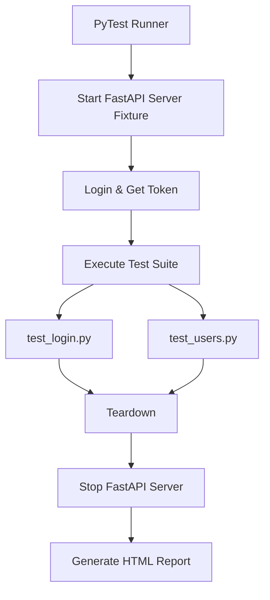

# 🚀 QA API Automation Project

A portfolio-ready API test automation project built with modern Python tools.

---

## 📌 Project Overview

This project demonstrates a complete, production-grade API test automation setup:

- **Local Mock API** built with FastAPI  
- **Automatic server orchestration** via PyTest fixtures  
- **Bearer token authentication flow**  
- **Data-driven testing** using JSON files  
- **Contract validation** with `jsonschema`  
- **CI/CD pipeline** powered by GitHub Actions  
- **HTML test reporting**

The goal is to simulate a real-world backend testing environment similar to banking or enterprise systems.

---

## 🏗 Architecture & Flow

📁 Project Structure
qa-api-automation-project/
├── .github/workflows/
│   └── ci.yml
├── app/
│   ├── main.py
│   ├── schemas.py
│   └── store.py
├── data/
│   └── credentials.json
├── src/
│   └── api_client.py
├── tests/
│   ├── conftest.py
│   ├── test_login.py
│   └── test_users.py
├── requirements.txt
└── README.md
🚀 How to Run Locally
1️⃣ Create Virtual Environment
python -m venv .venv

Activate:

Windows:

.venv\Scripts\Activate.ps1

Linux/Mac:

source .venv/bin/activate
2️⃣ Install Dependencies
pip install -r requirements.txt
3️⃣ Run Tests
python -m pytest -v

The FastAPI server is automatically started and stopped by PyTest.

🧪 Generate HTML Report
python -m pytest --html=report.html --self-contained-html

Open:

report.html
🔐 Authentication Flow

/api/login returns a mock Bearer token

Protected endpoints require:

Authorization: Bearer <token>

The token is automatically injected using the auth_api fixture.

🧱 Test Strategy

Positive and negative scenarios

Unauthorized access validation (401)

Resource not found validation (404)

JSON schema contract validation

Token-based authentication

Independent test data

Automatic setup & teardown

🔄 CI Pipeline

On every push:

Setup Python environment

Install dependencies

Run PyTest suite

Generate HTML report

Upload report as artifact

🎯 Key Skills Demonstrated

PyTest test architecture

FastAPI backend simulation

Bearer authentication handling

Fixture lifecycle orchestration

JSON Schema validation

CI/CD integration

Clean, maintainable project structure

👤 Author

Jiří Kodejš
QA Engineer
