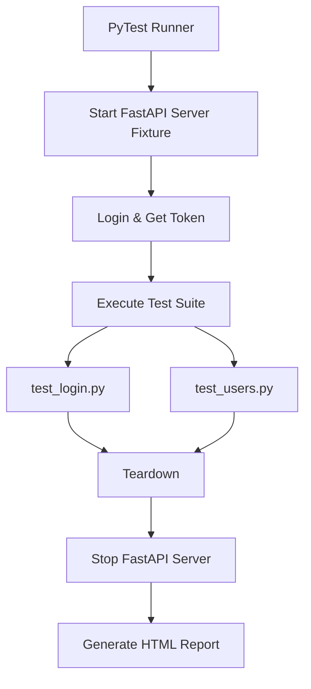

# 🚀 QA API Automation Project

A portfolio-ready API test automation project built with modern Python tools.

---

## 📌 Project Overview

This project demonstrates a complete, production-grade API test automation setup:

- **Local Mock API** built with FastAPI  
- **Automatic server orchestration** via PyTest fixtures  
- **Bearer token authentication flow**  
- **Data-driven testing** using JSON files  
- **Contract validation** with `jsonschema`  
- **CI/CD pipeline** powered by GitHub Actions  
- **HTML test reporting**

The goal is to simulate a real-world backend testing environment similar to banking or enterprise systems.

---

## 🏗 Architecture & Flow

📁 Project Structure

qa-api-automation-project/
├── .github/workflows/
│   └── ci.yml
├── app/
│   ├── main.py
│   ├── schemas.py
│   └── store.py
├── data/
│   └── credentials.json
├── src/
│   └── api_client.py
├── tests/
│   ├── conftest.py
│   ├── test_login.py
│   └── test_users.py
├── requirements.txt
└── README.md

🚀 How to Run Locally
1️⃣ Setup Virtual Environment
Windows:

python -m venv .venv
.venv\Scripts\Activate.ps1
Linux/Mac:

python -m venv .venv
source .venv/bin/activate
2️⃣ Install Dependencies

pip install -r requirements.txt
3️⃣ Run Tests
The FastAPI server is automatically started and stopped by the PyTest lifecycle.

python -m pytest -v
🧪 Reporting & Auth
Generate HTML Test Report
To generate a standalone, styled report, run:

python -m pytest --html=report.html --self-contained-html
Pak otevři soubor report.html v prohlížeči.

🔐 Authentication Flow
/api/login vrací dočasný Bearer token.

Chráněné endpointy vyžadují hlavičku: Authorization: Bearer <token>.

Token je automaticky spravován a injektován do testů přes fixture auth_api.

🧱 Test Strategy
Positive/Negative Scenarios: Validace očekávaného chování i chybových stavů.

Security: Ověření neautorizovaného přístupu (401).

Edge Cases: Validace nenalezených zdrojů (404) a nevalidních dat.

Schema Validation: Kontrola, zda odpovědi odpovídají JSON schématu.

Isolation: Nezávislá testovací data a čistý teardown pro každý běh.

🔄 CI Pipeline
GitHub Actions workflow běží při každém pushi:

Setup: Příprava Python prostředí.

Dependencies: Instalace knihoven.

Execution: Spuštění PyTest suite (včetně automatického startu API).

Artifacts: Nahrání HTML reportu pro audit.

🎯 Key Skills Demonstrated
Frameworks: PyTest, FastAPI, Requests.

Architecture: Page Object Model (POM) koncept aplikovaný na API.

DevOps: GitHub Actions, automatizace serverových procesů.

Quality: JSON Schema validation, CI/CD integrace.

👤 Author
Jiří Kodejš
QA Engineer
